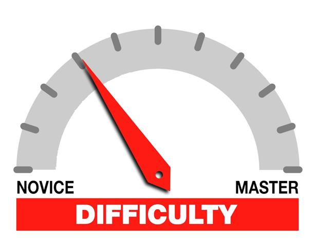

*Difficulty: How do Supply Chains utilize Efficiency and Responsiveness?*

In systems engineering and programming, it is an accepted truth that the most difficult problems usually involve human interaction. Applications are complex because user behavior is unpredictable. Similarly, designing and maintaining a global supply chain is fundamentally difficult because it is, at its core, a network designed to anticipate and serve human needs. 

When a system scales—whether it is a software deployment or a global manufacturing operation—the rigidity of the architecture often dictates its survival. Transforming a legacy system to meet changing requirements is supposed to be difficult. It challenges foundational industrial engineering methodologies. Ultimately, the question enterprise leaders must ask when facing these massive transformations is, "Is the cost of restructuring worth the survival of the business?"

By examining the historical shifts in the personal computer market, specifically the contrasting architectures of IBM and Dell, we can observe why adapting a supply chain is so challenging, and how concepts like the bullwhip effect and material flow optimization dictate market leadership.

---

## The Architectural Divide: Make-to-Stock vs. Make-to-Order

The fundamental difficulty in supply chain management lies in aligning the production cycle with actual consumer demand. The structural choices a company makes early on will define its agility in the marketplace.

### IBM’s Push Strategy (Make-to-Stock)
Historically, IBM relied on a highly structured **Push Strategy**. To make computers affordable, they mass-produced fixed quantities of standard machines. 
* **The Structure:** The production line was segregated into strict categories (monitors, processing units, peripherals), each fed by dedicated vendor supply chains.
* **The Flaw:** This system was optimized for cost reduction through economies of scale, assuming uniform customer preferences. When the market shifted toward customization and variety, IBM's rigid architecture could not adapt. Accurate demand forecasting became impossible because the system was designed to push inventory regardless of immediate market signals, leading to mounting losses and excess stockpiles.

### Dell’s Pull Strategy (Make-to-Order)
Conversely, Dell embraced the difficulty of dynamic customer relationships by engineering a **Pull Strategy**. 
* **The Structure:** Dell positioned customer requirements as paramount, utilizing a Just-In-Time (JIT) production model. Manufacturing only commenced when a specific online order was placed.
* **The Advantage:** By maintaining virtually zero finished-goods inventory and passing order requirements directly to vendors, Dell bypassed the traditional retail bottleneck. This tight integration of data and operations allowed them to drastically reduce lead times and offer unprecedented product variety.

---

## Navigating the Bullwhip Effect

The difficulties IBM faced highlight a classic supply chain vulnerability: the **Bullwhip Effect**. This phenomenon occurs when small fluctuations in retail demand cause progressively larger fluctuations in demand at the wholesale, distributor, and manufacturer levels.

In a rigid "push" system, a slight dip in consumer interest for a specific desktop model results in severe misalignments. Because IBM's vendors were geared to produce a "fixed and consistent quantity," a slowdown at the retail level meant vendors had to suddenly halt production, leaving massive amounts of work-in-progress (WIP) inventory stranded. The lack of accurate, data-driven performance monitoring between the retailer and the manufacturer amplified the disruption.

Dell neutralized the bullwhip effect by operating entirely on actual demand data. By selling directly to the consumer online and coordinating immediately with suppliers, Dell removed the speculative layers of the supply chain. The signal from the customer was transmitted instantly to the vendor, eliminating the distorted forecasting that plagues traditional retail networks.

---

## Designing for Sustainable Operations and Material Flow

A truly sustainable supply chain minimizes waste—not just in terms of raw materials, but in time, transportation, and redundant processes. Dell recognized that physical transport processes that do not add value are inherently wasteful.

Initially, Dell sourced cheaper components globally (e.g., India and Mexico) and routed them to a Texas factory for final assembly. However, through rigorous layout and material flow optimization, they realized that bringing fully manufactured monitors from Mexico to Texas just to be placed in a box with a processing unit was highly inefficient. 

To build a more sustainable and lean network, Dell restructured its logistics:
1.  **Strategic Partnerships:** They integrated directly with logistics providers like UPS.
2.  **Merge-In-Transit:** Instead of shipping peripherals to a central Dell factory, vendors shipped directly to UPS warehouses. 
3.  **Decentralized Assembly:** UPS took over the final combination, packing, and shipping of the complete desktop.

This structural modification drastically cut shipping costs, reduced the carbon footprint associated with redundant transit, and demonstrated that combining advanced tracking technology with innovative facility management yields a highly efficient, sustainable operation.

---

## Case Study Analysis: Reaping the Benefits of Modifications

**a) Explain the challenges faced by IBM in transforming its supply chain to become more responsive.**
IBM’s primary challenge was structural rigidity. Their entire production and vendor network was built for a make-to-stock paradigm focused on high volume and low variety. Transforming this required unwinding dedicated, inflexible supply chains that were contracted to provide fixed quantities. When consumer demand shifted to require variety, IBM could not easily throttle their production lines down or re-tool them for customization without incurring massive financial losses and vendor friction.

**b) How did Dell incorporate efficiencies in its supply chain?**
Dell engineered efficiencies through three primary vectors:
* **JIT Manufacturing:** Adopting a make-to-order pull strategy ensured capital was not tied up in unsold inventory.
* **Direct-to-Consumer Model:** Eliminating brick-and-mortar retail stores and taking orders exclusively online reduced lead times and overhead.
* **Logistics Delegation:** By outsourcing component manufacturing globally to reduce costs, and partnering with UPS to handle the merge-in-transit (combining parts directly at the logistics hub), Dell eliminated non-value-added transportation steps.

**c) Considering analytical models, which models are best suited to measuring supply chain efficiency?**
To accurately measure the efficiency of these distinct architectures, organizations rely on continuous data monitoring and modeling:
* **Inventory Optimization Models (e.g., Economic Order Quantity - EOQ):** While less relevant to Dell's JIT system, EOQ models would be critical in analyzing the carrying costs and order costs that ultimately damaged IBM's push strategy.
* **Network Optimization Models:** Used to evaluate the spatial and financial efficiencies of node placement, such as Dell’s decision to utilize UPS warehouses as integration points rather than centralizing in Texas.
* **The SCOR (Supply Chain Operations Reference) Model:** This framework is ideal for measuring comprehensive performance metrics across reliability, responsiveness, agility, costs, and asset management, allowing a clear quantitative comparison between a legacy push system and an agile pull system.

And the final answer - it's supposed to be difficult, and it's supposed to challenge you, just like everything else that humans do that is difficult: programming, engineering, engaging in relationships, pondering the universe, etc.

Ultimately the question you should really ask yourself if something if particularly difficult is then "is it worth it"? That is something that is context specific and only you can answer yourself.

**Image Source:** [Pinterest](https://pin.it/TsGMpZVBJ)
