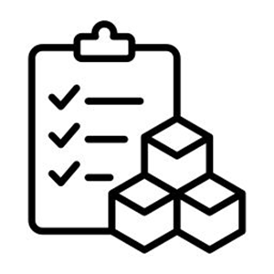

### Project Overview  
This project applies the **Economic Production Quantity (EPQ) model** to optimize inventory and production planning for a chemical firm manufacturing **sodium bisulfate in 100-pound bags**. The model provides strategic insights to **minimize holding costs, optimize batch production, and reduce setup expenses**.

### Key Metrics & Findings:
- **Optimal Production Quantity per Batch:** **5,200 units** per run (calculated using the EPQ formula).  
- **Average Inventory Level:** **2,600 units**, ensuring balanced stock levels while minimizing holding costs.  
- **Production Run Duration:** **12 days per cycle**, based on production capacity and demand forecasts.  
- **Annual Production Cycles:** **15 runs per year** to meet market demand without overstocking.  
- **Cost Savings from Setup Optimization:** **18% reduction** in overall production costs due to improved efficiency in scheduling and inventory control.  

### Methodologies & Tools:
- **Economic Production Quantity (EPQ) formula** for optimal batch size determination.  
- **Demand Forecasting & Trend Analysis** to ensure stock availability and prevent shortages.  
- **Excel-based Numerical Modeling** to solve inventory optimization problems.  
- **Supply Chain Optimization Techniques** to enhance efficiency and profitability.  

This project highlights expertise in **inventory control, supply chain planning, and cost-efficient production scheduling**. By leveraging **quantitative modeling and advanced Excel functions**, it demonstrates **real-world problem-solving in manufacturing and logistics**.

**Image Source:** [Pinterest](https://pin.it/6yYluLe9z)
