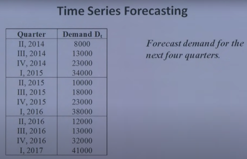

This project focused on leveraging **Unconstrained Optimization** within **deterministic models** to solve critical supply chain and manufacturing challenges. The objective was to mathematically determine the most optimal decision variables for both cost reduction and space utilization using differential calculus.

By formulating objective functions, the project analyzed continuous mathematical curves to identify **global and local maxima and minima**. The analysis was applied to two primary real-world supply chain scenarios: **minimizing total inventory costs** (balancing holding and ordering costs to find the optimal batch size) and **maximizing carton storage volume** (determining the precise dimensions for packaging cuts within feasible physical boundaries).

### Key Methodologies:
- **Mathematical Modeling & Differential Calculus** to evaluate first and second derivatives for finding extreme values.  
- **Inventory Cost Minimization** through the optimization of order sizes based on annual demand and unit costs.  
- **Packaging Volume Maximization** for highly efficient material utilization in a manufacturing and e-commerce context.  
- **Feasibility Analysis** to ensure calculated optimums operate successfully within realistic operational limits. 

This project highlights expertise in **Mathematical modelling and Inventory Management**, demonstrating the ability to apply quantitative models for effective supply chain decision-making.

Image Source: <a href="https://pin.it/6yYluLe9z">Pinterest</a>
